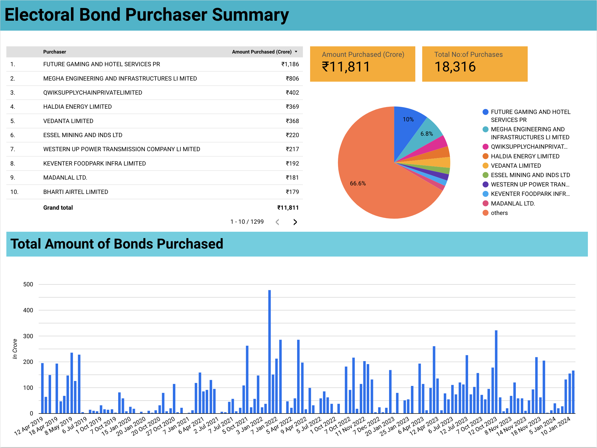
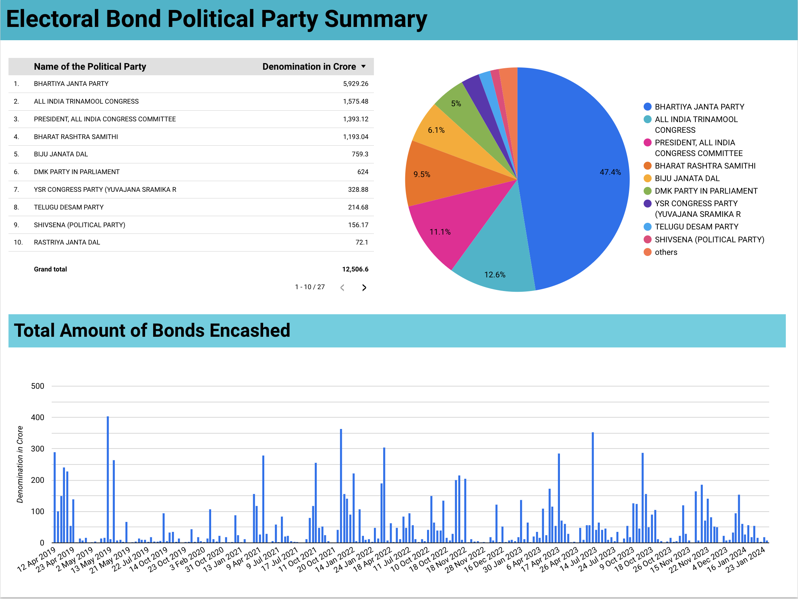
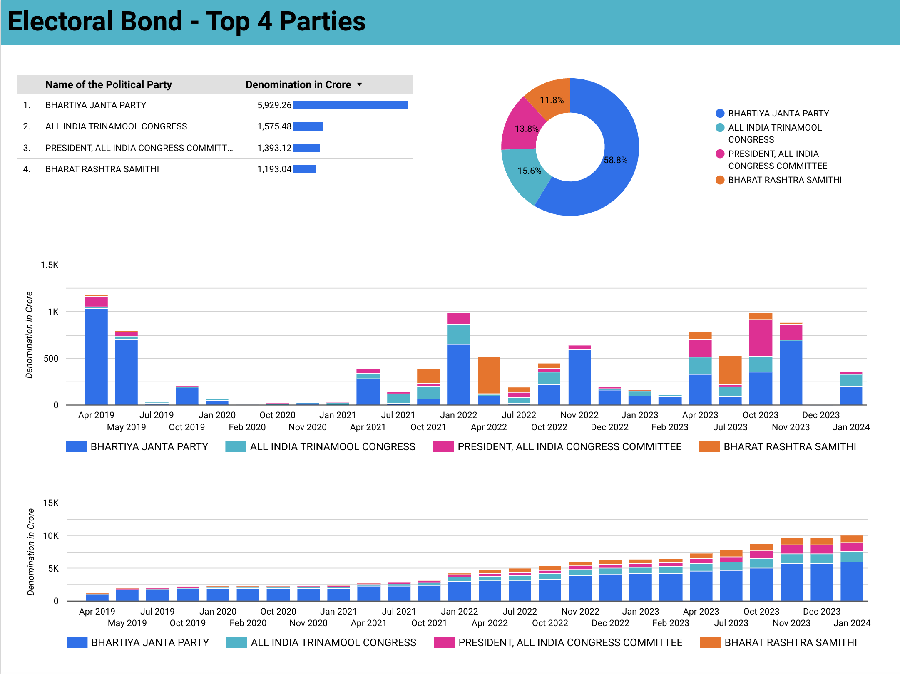

# Electoral Bond Explorer

Forked from - https://github.com/cvrajeesh/electoral-bond-data 

## Jupyter Notebook that helps your run your own analysis.

To run this on any machine -

Pre-requisites - python (comes preinstalled on linux & mac. Windows users can download and install)

```
pip install notebook pandas numpy ipywidgets

jupyter notebook 

```

and you should get a dynamic working environment where you can make queries. In case you need help making changes, feel free to use chatgpt, most of the notebook was written with the help of chatgpt and it is actually my first jupyter notebook ever. Long live AI, long live India and long live democracy in India <3.


**Source:** https://www.eci.gov.in/disclosure-of-electoral-bonds

Files are under `/data` directory and PDF files are under `/source` directory.


*Note:* Data is extracted using automated tools. If you find anything incorrect. Please open a PR


## Report

Full report URL: https://lookerstudio.google.com/reporting/cf949a5c-f54c-428c-9566-9c6e2d7a97bf

### Screenshots






